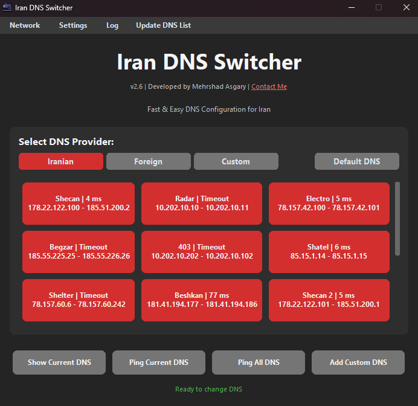

  
# Iran DNS Switcher: ابزار گرافیکی برای تغییر سریع دی ان اس، رفع تحریم، گیم و کاهش پینگ 🚀

🎛️  یک ابزار گرافیکی (GUI) برای ویندوز است که به شما امکان می‌دهد تنها با یک کلیک DNS سیستم‌تان را به سریع‌ترین و پایدارترین DNSهای ایرانی یا بین‌المللی تغییر دهید برای رفع تحریم، گیم و کاهش پینگ.

صرفا جهت راحتی شما :)

**نسخه فعلی:** V2.5

## ✨ ویژگی‌ها

- رابط کاربری زیبا، ساده و سریع
- بدون نیاز به نصب
- تغییر سریع DNS تنها با یک کلیک  
- شامل DNS های محبوب داخلی و بین‌المللی (بیش از 15 دی ان اس)
- گزینه بازگشت DNS به حالت دیفالت (DHCP)  
- نمایش DNS فعلی سیستم
- قابلیت گرفتن پینگ تمام DNS
- قابلیت افزودن DNS دلخواه به برنامه (کاستوم دی ان اس)
- مشاهده تمام شبکه های متصل و انتخاب (در صورت نیاز)
- اجرا با دسترسی Administrator  

## 🖼️ نمایی از برنامه

## 🔽 دانلود نرم‌افزار

📦 [دانلود نسخه اجرایی (EXE)](https://github.com/mehrshadasgary/Iran-DNS-Switcher/releases/latest/download/Iran_DNS_Switcher.exe)

> آخرین نسخه منتشرشده از برنامه را از لینک بالا دانلود کنید.
> 
## 🔐 اجرای اولیه و هشدار SmartScreen یا ارور ویروس

 اگر هنگام اجرای برنامه با پیام زیر از سمت ویندوز مواجه شدید:

Windows protected your PC
Microsoft Defender SmartScreen prevented an unrecognized app from starting...

نگران نباشید! 
این پیام فقط به این دلیله که برنامه جدید و هنوز توسط Microsoft به‌طور کامل شناسایی نشده. چون فایل اجرایی هنوز گواهی دیجیتال امضا شده (Code Signing Certificate) نداره، ویندوز برای احتیاط هشدار نشون می‌ده.

📂 کد کامل این نرم‌افزار در همین مخزن GitHub در دسترس است، بنابراین می‌توانید با خیال راحت بررسی کنید که برنامه چه کاری انجام می‌دهد.

✅ برای اجرای برنامه مراحل زیر رو انجام دهید:

روی دکمه "More info" کلیک کنید

سپس روی دکمه "Run anyway" کلیک کنید

این کار فقط بار اول نیاز هست. دفعات بعد، ویندوز دیگر مزاحمتی ایجاد نمی‌کند.

## 🌐 لیست DNSهای پشتیبانی‌شده

| نام DNS       | آدرس اصلی (Primary) | آدرس ثانویه (Secondary) |
|---------------|----------------------|--------------------------|
| Shecan        | 178.22.122.100       | 185.51.200.2             |
| Radar         | 10.202.10.10         | 10.202.10.11             |
| Electro       | 78.157.42.100        | 78.157.42.101            |
| Begzar        | 185.55.226.26        | 185.55.226.25            |
| 403           | 10.202.10.202        | 10.202.10.102            |
| Google        | 8.8.8.8              | 8.8.4.4                  |
| Cloudflare    | 1.1.1.1              | 1.0.0.1                  |
| Auto (DHCP)   | تنظیم خودکار        | تنظیم خودکار            |
| Custom DNS    | آدرس دلخواه شما              | آدرس دلخواه شما                  |

## 🖥️ نحوه استفاده

1. برنامه `Iran_DNS_Switcher.exe` را اجرا کنید.  
2. در صورت نیاز، دسترسی Administrator درخواست خواهد شد.  
3. روی یکی از گزینه‌های DNS کلیک کنید تا تنظیمات به‌صورت خودکار اعمال شود.  
4. با زدن "Show Current DNS" می‌توانید تنظیمات فعلی سیستم را ببینید.

## 👨‍💻 توسعه‌دهنده

Mehrshad Asgary  
🔗 [mehrshadasgary.ir](https://mehrshadasgary.ir)

## 📜 مجوز

این پروژه تحت لایسنس GNU General Public License v3.0 (GPLv3) منتشر شده است.
برای جزئیات بیشتر، به فایل <a href="LICENSE">LICENSE.md</a> مراجعه کنید.

