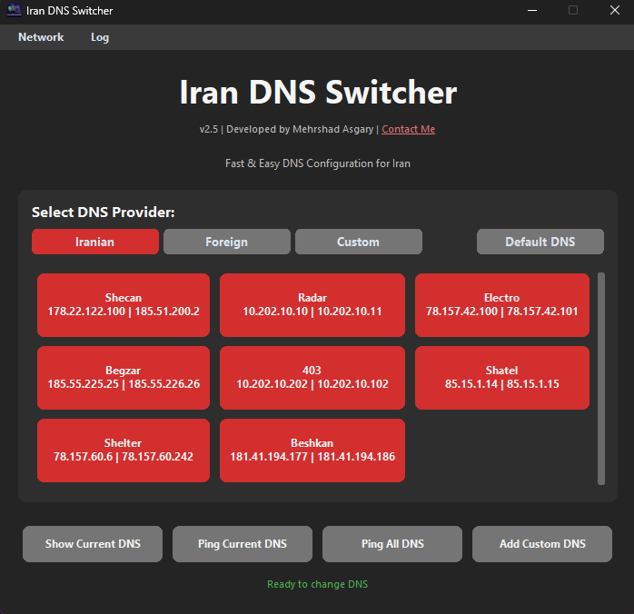

# Iran DNS Switcher v1.0

🎛️  یک ابزار گرافیکی (GUI) برای ویندوز است که به شما امکان می‌دهد تنها با یک کلیک DNS سیستم‌تان را به سریع‌ترین و پایدارترین DNSهای ایرانی یا بین‌المللی تغییر دهید.

صرفا جهت راحتی شما :)

## ✨ ویژگی‌ها

- رابط کاربری ساده و سریع  
- تغییر سریع DNS تنها با یک کلیک  
- شامل DNSهای محبوب داخلی و بین‌المللی  
- گزینه بازگشت به حالت خودکار (DHCP)  
- نمایش DNS فعلی سیستم  
- اجرا با دسترسی Administrator  

## 🖼️ نمایی از برنامه

## 🔽 دانلود نرم‌افزار

📦 [دانلود نسخه اجرایی (EXE)](https://github.com/mehrshadasgary/Iran-DNS-Switcher/releases/latest/download/Iran_DNS_Switcher.exe)

> آخرین نسخه منتشرشده از برنامه را از لینک بالا دانلود کنید.

## 🌐 لیست DNSهای پشتیبانی‌شده

| نام DNS       | آدرس اصلی (Primary) | آدرس ثانویه (Secondary) |
|---------------|----------------------|--------------------------|
| Shecan        | 178.22.122.100       | 185.51.200.2             |
| Radar         | 10.202.10.10         | 10.202.10.11             |
| Electro       | 78.157.42.100        | 78.157.42.101            |
| Begzar        | 185.55.226.26        | 185.55.226.25            |
| 403           | 10.202.10.202        | 10.202.10.102            |
| Google        | 8.8.8.8              | 8.8.4.4                  |
| Cloudflare    | 1.1.1.1              | 1.0.0.1                  |
| Auto (DHCP)   | تنظیم خودکار        | تنظیم خودکار            |

## 🖥️ نحوه استفاده

1. برنامه `Iran_DNS_Switcher.exe` را اجرا کنید.  
2. در صورت نیاز، دسترسی Administrator درخواست خواهد شد.  
3. روی یکی از گزینه‌های DNS کلیک کنید تا تنظیمات به‌صورت خودکار اعمال شود.  
4. با زدن "Show Current DNS" می‌توانید تنظیمات فعلی سیستم را ببینید.

## 👨‍💻 توسعه‌دهنده

Mehrshad Asgary  
🔗 [mehrshadasgary.ir](https://mehrshadasgary.ir)

## 📜 مجوز

این پروژه تحت لایسنس MIT منتشر شده است.

